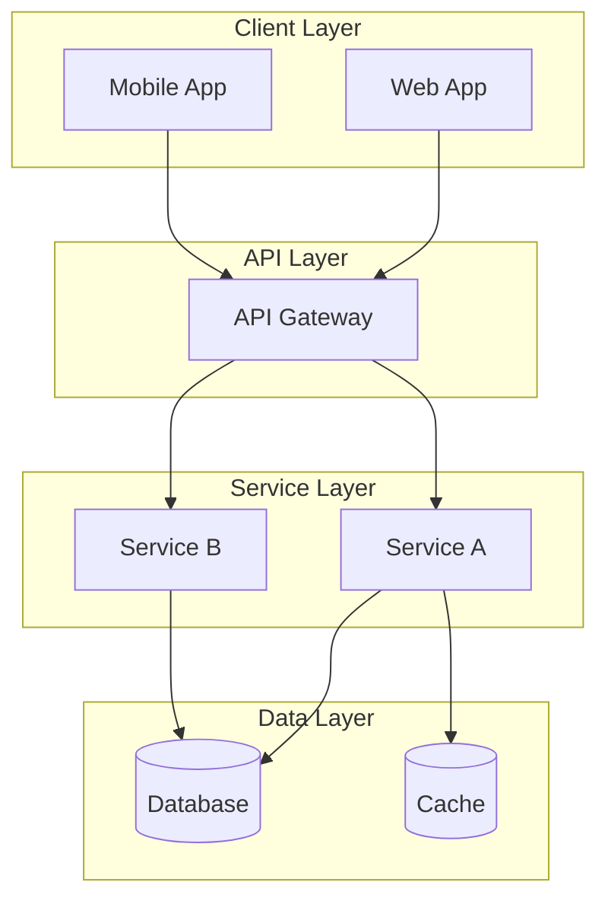

# Explain Architecture

Generate a comprehensive explanation of this system's architecture for onboarding new team members or documentation.

## What to Cover

### 1. High-Level Overview
- What does this system do?
- Who are the users?
- What problem does it solve?

### 2. Architecture Style
- Monolith / Microservices / Serverless / Hybrid
- Design patterns used (MVC, Clean Architecture, etc.)
- Key architectural decisions and rationale

### 3. Component Diagram
Create a Mermaid diagram showing:
- Major components/services
- Data stores
- External integrations
- Communication patterns

### 4. Data Flow
- How does a typical request flow through the system?
- Where is data stored and how does it move?
- Caching layers and strategies

### 5. Key Abstractions
- Core domain models/entities
- Important interfaces/contracts
- Shared utilities and helpers

### 6. External Dependencies
- Third-party services
- APIs consumed
- Infrastructure requirements

### 7. Security Model
- Authentication approach
- Authorization patterns
- Data protection measures

### 8. Deployment Architecture
- How is it deployed?
- Environment configuration
- Scaling approach

## Output Format

```markdown
## Architecture Overview

### Summary
[2-3 paragraphs explaining the system]

### Architecture Diagram



### Component Descriptions

| Component | Purpose | Technology |
|-----------|---------|------------|
| ... | ... | ... |

### Data Flow Example

1. User action triggers...
2. Request goes to...
3. Service processes...
4. Data is stored in...
5. Response returns...

### Key Design Decisions

| Decision | Rationale | Trade-offs |
|----------|-----------|------------|
| ... | ... | ... |

### Directory Mapping

```
src/
├── components/  → UI components (React)
├── services/    → Business logic
├── models/      → Data models
├── utils/       → Shared utilities
└── config/      → Configuration
```

### Getting Started

For new developers:
1. Understand X first
2. Then explore Y
3. Key files to read: ...
```

## Generate Explanation

Please analyze the codebase and generate a clear architecture explanation suitable for developer onboarding.
