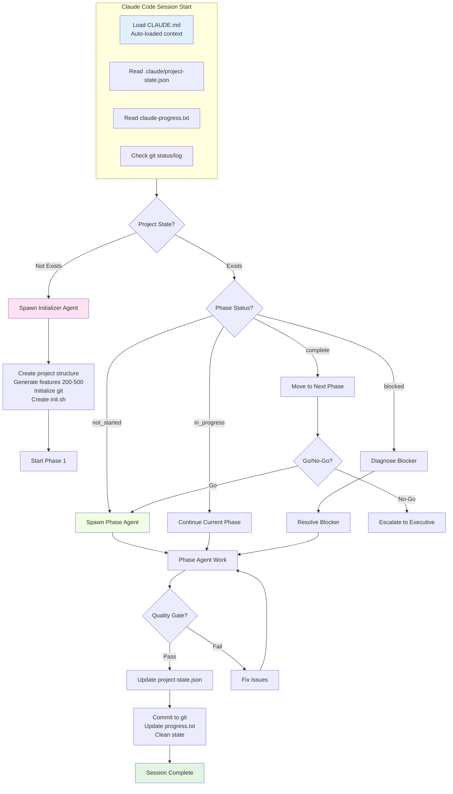
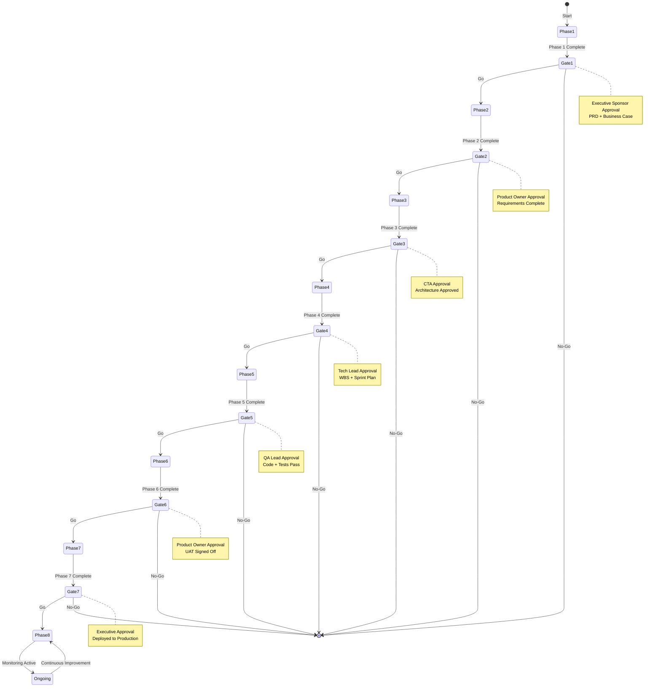
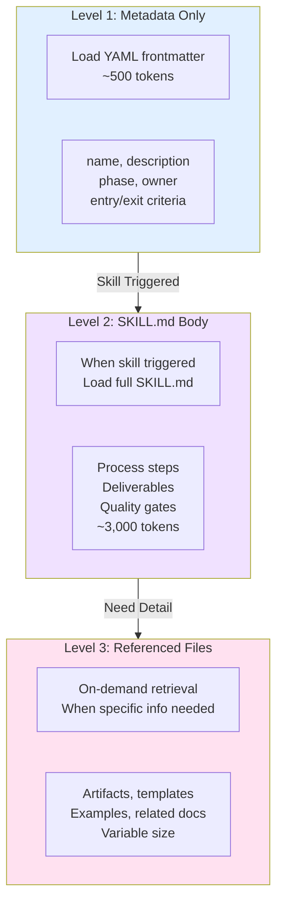
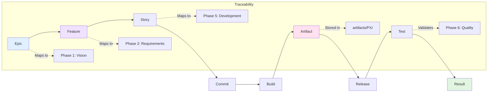
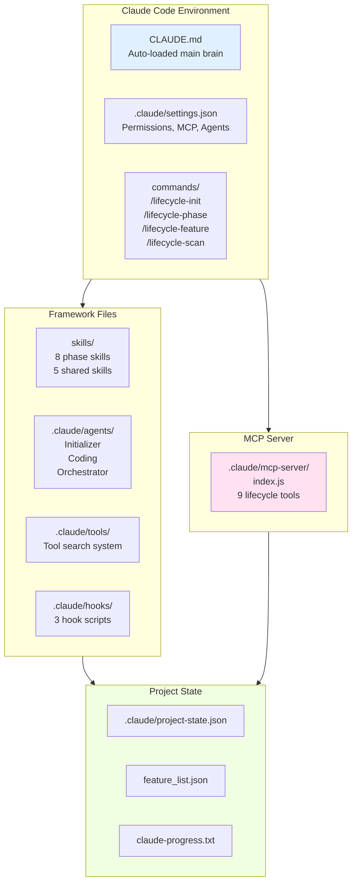

```mermaid
flowchart TB
    subgraph Phases[All 8 Phases]
        P1[Phase 1]
        P2[Phase 2]
        P3[Phase 3]
        P4[Phase 4]
        P5[Phase 5]
        P6[Phase 6]
        P7[Phase 7]
        P8[Phase 8]
    end

    subgraph Shared[Shared Services]
        Security[Security Framework<br/>shared/security/SKILL.md]
        Quality[Quality Framework<br/>shared/quality/SKILL.md]
        Compliance[Compliance Framework<br/>shared/compliance/SKILL.md]
        Governance[Governance Framework<br/>shared/governance/SKILL.md]
        Roles[16 Roles<br/>shared/roles/SKILL.md]
    end

    P1 & P2 & P3 & P4 & P5 & P6 & P7 & P8 -.->|Available to all| Security
    P1 & P2 & P3 & P4 & P5 & P6 & P7 & P8 -.->|Available to all| Quality
    P1 & P2 & P3 & P4 & P5 & P6 & P7 & P8 -.->|Available to all| Compliance
    P1 & P2 & P3 & P4 & P5 & P6 & P7 & P8 -.->|Available to all| Governance
    P1 & P2 & P3 & P4 & P5 & P6 & P7 & P8 -.->|Reference| Roles

    style Security fill:#ffe1e1
    style Quality fill:#e1ffe1
    style Compliance fill:#e1e1ff
    style Governance fill:#fff4e1
    style Roles fill:#f0e1ff
```

# OCTALUME Framework Visualization

Complete visual guide to the OCTALUME Enterprise Lifecycle Framework

**Note:** This file contains Mermaid diagram definitions. For best viewing, use a markdown viewer that supports Mermaid diagrams (GitHub, GitLab, VS Code with Mermaid preview, or Mermaid Live Editor).

## Who This Is For

This document serves these audiences:

- **Developers** - Understanding workflow and process flows
- **Architects** - Visualizing system and phase transitions
- **Project Managers** - Understanding milestone dependencies
- **Technical Leads** - Planning phase transitions and go/no-go decisions

**Prerequisites:** Familiarity with Mermaid diagrams or access to a Mermaid-compatible viewer.

## Table of Contents

1. [Complete Lifecycle Overview](#complete-lifecycle-overview)
2. [Phase Timeline](#phase-timeline)
3. [Agent Orchestration Flow](#agent-orchestration-flow)
4. [Quality Gates State Machine](#quality-gates-state-machine)
5. [Skill Loading Sequence](#skill-loading-sequence)
6. [Traceability Chain](#traceability-chain)
7. [Shared Services Across Phases](#shared-services-across-phases)
8. [Claude Code Integration](#claude-code-integration)
9. [Beginner Onboarding Flow](#beginner-onboarding-flow)

## Complete Lifecycle Overview

The following diagram shows the complete 8-phase lifecycle with quality gates:


## Phase Timeline

Visual timeline of all 8 phases showing key activities:

```mermaid
timeline
    title OCTALUME Framework - Complete Project Timeline
    section Phase 1: Vision
        Product Owner : Create PRD : Business case : Market analysis
        Security Lead : Security considerations
    section Phase 2: Requirements
        Product Owner : Functional requirements : NFRs
        Security Lead : Security requirements
        Compliance Officer : Compliance requirements
    section Phase 3: Architecture
        CTA : System architecture : Security architecture
        Data Architect : Data architecture
        Cloud Architect : Infrastructure design
    section Phase 4: Planning
        Project Manager : WBS : Resource plan : Sprint plan
        QA Lead : Test strategy
        DevOps : CI/CD plan
    section Phase 5: Development
        Tech Lead : Sprint planning : Code reviews
        Developers : Code development : Unit tests
        Security Lead : Shift-left security
    section Phase 6: Quality
        QA Lead : Test execution : Defect management
        Security Lead : Security testing : Pen testing
        Performance Engineer : Performance testing
        Compliance Officer : Compliance validation
    section Phase 7: Deployment
        DevOps : Deployment execution : Release
        SRE : Monitoring setup
    section Phase 8: Operations
        SRE : Monitoring : Incidents : Maintenance
        Security Lead : Security operations
        Compliance Officer : Audit readiness
```

## Agent Orchestration Flow

How agents work together in the OCTALUME framework:



## Quality Gates State Machine

State machine showing quality gate transitions:



## Skill Loading Sequence

How skills load progressively to optimize context usage:



## Traceability Chain

How artifacts trace through the entire lifecycle:



## Shared Services Across Phases

How shared services (security, quality, compliance, governance) serve all phases:



## Claude Code Integration

How OCTALUME integrates with Claude Code:



## Beginner Onboarding Flow

Step-by-step flow for new users:

```mermaid
flowchart TD
    Start([Start Here]) --> Install[Install Claude Code<br/>npm install -g @anthropic-ai/claude-code]
    Install --> Login[claude login]
    Login --> Navigate[cd to project directory]
    Navigate --> Init[/lifecycle-init<br/>Initialize new project]
    Init --> Create[Framework creates:<br/>• Project structure<br/>• 200-500 features<br/>• Git repository<br/>• Configuration files]
    Create --> Work[Claude works on features<br/>ONE AT A TIME]
    Work --> Test[Test each feature<br/>thoroughly]
    Test --> Commit[Commit to git<br/>with artifacts]
    Commit --> More{More features?}
    More -->|Yes| Work
    More -->|No| Phase{Phase complete?}
    Phase -->|No| Work
    Phase -->|Yes| Gate[Go/No-Go decision]
    Gate --> NextPhase[Move to next phase]
    NextPhase --> Work

    style Start fill:#e1f5e1
    style Init fill:#f0e1ff
    style Work fill:#e1f0ff
    style Test fill:#fff4e1
    style Commit fill:#f0ffe1
```

## Viewing These Diagrams

### Options for Viewing Mermaid Diagrams

1. **GitHub/GitLab** - Native support, automatic rendering
2. **VS Code** - Install "Markdown Preview Mermaid Support" extension
3. **Mermaid Live Editor** - https://mermaid.live/
4. **Typora** - Markdown editor with Mermaid support
5. **Obsidian** - Note-taking app with Mermaid plugin

### How to View

1. Copy the diagram code block (including ```mermaid markers)
2. Paste into Mermaid Live Editor (https://mermaid.live/)
3. Or open this file in a supported markdown viewer

## Additional Resources

For more details, see:
- `README.md` - Main framework overview
- `SETUP_GUIDE.md` - Setup and usage guide
- `CLAUDE.md` - Auto-loaded framework context
- `DIRECTORY_STRUCTURE.md` - Complete project directory listing

---

**Version:** 1.0.0
**Last Updated:** 2026-01-16
**Review Completed By:** OCTALUME TEAM
