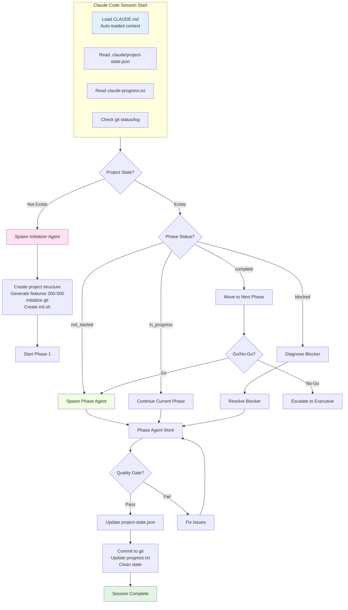
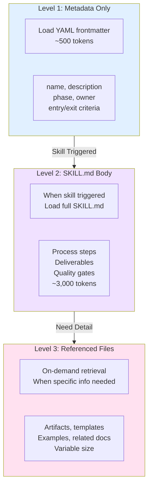
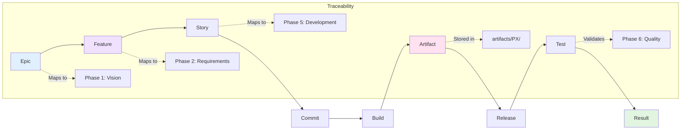
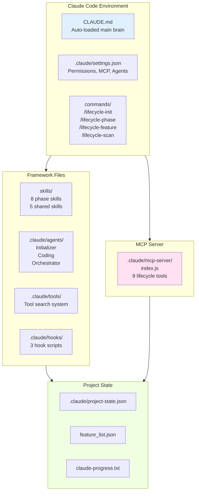

# Visualizing OCTALUME: Your Complete Picture

**Hey there!** I know diagrams can feel overwhelming—like staring at a map without knowing where you are. But don't worry. Think of this as your visual guide to understanding how OCTALUME works. We'll walk through each diagram together, and I'll explain what you're looking at in plain language.

---

## What You'll Find Here

This document is packed with visual diagrams (called "Mermaid diagrams") that show:
- The complete journey from idea to production
- How different parts of OCTALUME work together
- How decisions flow through the system
- Where quality happens (everywhere!)

**Who this is for:**
- **Developers** wanting to understand the workflow
- **Architects** visualizing how phases connect
- **Project Managers** seeing how milestones depend on each other
- **Technical Leads** planning phase transitions
- **Curious minds** who just want to see how it all fits together

<details>
<summary>🎨 How to view these diagrams</summary>

**Quick options:**
1. **GitHub/GitLab** — Just open this file there, diagrams render automatically
2. **VS Code** — Install the "Markdown Preview Mermaid Support" extension
3. **Mermaid Live Editor** — Go to https://mermaid.live/ and paste diagram code
4. **Obsidian** — Use the Mermaid plugin
5. **Typora** — Markdown editor with built-in Mermaid support

**Pro tip:** If diagrams aren't rendering, copy the code block (including the ```mermaid part) and paste it into https://mermaid.live/

</details>

---

## Table of Contents

Pick what interests you, or read through in order:

1. **[Complete Lifecycle Overview](#complete-lifecycle-overview)** — The big picture from idea to operations
2. **[Phase Timeline](#phase-timeline)** — When things happen
3. **[Agent Orchestration Flow](#agent-orchestration-flow)** — How Claude's agents work together
4. **[Quality Gates State Machine](#quality-gates-state-machine)** — Go/No-Go decisions explained
5. **[Skill Loading Sequence](#skill-loading-sequence)** — How OCTALUME manages information efficiently
6. **[Traceability Chain](#traceability-chain)** — Following every decision from start to finish
7. **[Shared Services Across Phases](#shared-services-across-phases)** — Security, quality, compliance everywhere
8. **[Claude Code Integration](#claude-code-integration)** — How OCTALUME plugs into Claude Code
9. **[Beginner Onboarding Flow](#beginner-onboarding-flow)** — Your first project, step by step

---

## Complete Lifecycle Overview

**Imagine:** You have a business idea. Now what? This diagram shows the entire journey from that initial spark all the way to running a live system—and beyond.

```mermaid
flowchart TB
    Start([Business Idea]) --> P1

    subgraph P1 [Phase 1: Vision & Strategy]
        P1_Owner[Product Owner]
        P1_Docs[PRD, Business Case<br/>Market Analysis]
        P1_Out[Approved PRD]
    end

    P1 --> Gate1{Go/No-Go?<br/>Executive Sponsor}
    Gate1 -->|Go| P2
    Gate1 -->|No-Go| End([Terminated])

    subgraph P2 [Phase 2: Requirements & Scope]
        P2_Owner[Product Owner]
        P2_Docs[Requirements, NFRs<br/>Security, Compliance<br/>Traceability Matrix]
        P2_Out[Approved Requirements]
    end

    P2 --> Gate2{Go/No-Go?<br/>Product Owner}
    Gate2 -->|Go| P3

    subgraph P3 [Phase 3: Architecture & Design]
        P3_Owner[CTA]
        P3_Docs[System Architecture<br/>Security Architecture<br/>Data Architecture]
        P3_Out[Approved Design]
    end

    P3 --> Gate3{Go/No-Go?<br/>CTA}
    Gate3 -->|Go| P4

    subgraph P4 [Phase 4: Development Planning]
        P4_Owner[Project Manager]
        P4_Docs[WBS, Resource Plan<br/>Sprint Plan, Risk Mgmt]
        P4_Out[Approved Plan]
    end

    P4 --> Gate4{Go/No-Go?<br/>Tech Lead}
    Gate4 -->|Go| P5

    subgraph P5 [Phase 5: Development Execution]
        P5_Owner[Tech Lead]
        P5_Docs[Code, Reviews<br/>Unit Tests, Integration]
        P5_Out[Working Software]
        P5_Note[Agile Sprints<br/>2-week iterations]
    end

    P5 --> Gate5{Go/No-Go?<br/>QA Lead}
    Gate5 -->|Go| P6

    subgraph P6 [Phase 6: Quality & Security]
        P6_Owner[QA Lead]
        P6_Docs[QA Testing, Security<br/>Performance, Pen Test<br/>UAT, Compliance]
        P6_Out[Validated Build]
    end

    P6 --> Gate6{Go/No-Go?<br/>Product Owner}
    Gate6 -->|Go| P7

    subgraph P7 [Phase 7: Deployment & Release]
        P7_Owner[DevOps]
        P7_Docs[Deployment Plan<br/>Release Notes<br/>Rollback Plan]
        P7_Out[Released to Production]
    end

    P7 --> Gate7{Go/No-Go?<br/>Executive}
    Gate7 -->|Go| P8

    subgraph P8 [Phase 8: Operations & Maintenance]
        P8_Owner[SRE]
        P8_Docs[Monitoring, Incidents<br/>Patches, Improvements<br/>Audit, Compliance]
        P8_Out[Operating System]
    end

    P8 --> Ongoing[Continuous Improvement]

    style Start fill:#e1f5e1
    style End fill:#f5e1e1
    style Gate1 fill:#fff4e1
    style Gate2 fill:#fff4e1
    style Gate3 fill:#fff4e1
    style Gate4 fill:#fff4e1
    style Gate5 fill:#fff4e1
    style Gate6 fill:#fff4e1
    style Gate7 fill:#fff4e1
    style Ongoing fill:#e1f5e1
```



### What You're Looking At

**The colored boxes (phases):**
- Each box represents a phase of work
- Inside each box: Who owns it, what gets created, what comes out
- Numbers 1-8 show the order (you don't skip around)

**The diamonds (gates):**
- These are decision points—think of them as checkpoints
- At each gate, someone decides: "Do we go forward or stop?"
- **Go** = Move to next phase
- **No-Go** = Stop and fix issues (or terminate the project)

**The flow:**
- Start at the top (Business Idea)
- Move down through phases 1-8
- End at the bottom (Continuous Improvement)

<details>
<summary>🤔 Why are there gates between phases?</summary>

Great question! Think of it like building a house:

- **Phase 1 (Vision):** "Here's what we want to build"
- **Gate 1:** "Is this a good idea? Should we proceed?"
- **Phase 2 (Requirements):** "Here are the specifics"
- **Gate 2:** "Do we know enough to start designing?"
- ...and so on

Without gates, you might:
- Build the wrong thing
- Discover major problems too late
- Waste time and money on doomed projects

Gates = Quality control. They catch problems early.

</details>

---

## Phase Timeline

**Question:** "How long does all this take?" This timeline shows when activities happen across all 8 phases.

```mermaid
timeline
    title OCTALUME Framework - Complete Project Timeline
    section Phase 1: Vision
        Product Owner : Create PRD : Business case : Market analysis
        Security Lead : Security considerations
    section Phase 2: Requirements
        Product Owner : Functional requirements : NFRs
        Security Lead : Security requirements
        Compliance Officer : Compliance requirements
    section Phase 3: Architecture
        CTA : System architecture : Security architecture
        Data Architect : Data architecture
        Cloud Architect : Infrastructure design
    section Phase 4: Planning
        Project Manager : WBS : Resource plan : Sprint plan
        QA Lead : Test strategy
        DevOps : CI/CD plan
    section Phase 5: Development
        Tech Lead : Sprint planning : Code reviews
        Developers : Code development : Unit tests
        Security Lead : Shift-left security
    section Phase 6: Quality
        QA Lead : Test execution : Defect management
        Security Lead : Security testing : Pen testing
        Performance Engineer : Performance testing
        Compliance Officer : Compliance validation
    section Phase 7: Deployment
        DevOps : Deployment execution : Release
        SRE : Monitoring setup
    section Phase 8: Operations
        SRE : Monitoring : Incidents : Maintenance
        Security Lead : Security operations
        Compliance Officer : Audit readiness
```

### What This Tells You

**Parallel work:** Notice how different roles work at the same time. For example, in Phase 3:
- CTA is designing system architecture
- Data Architect is designing data architecture
- Cloud Architect is designing infrastructure

**This means:** Work happens in parallel, not sequentially. The architect doesn't wait for the data architect to finish—they work together.

**Overlapping roles:** Security appears in almost every phase! Same with quality and compliance. This is intentional—these aren't "add-ons," they're baked in from the start.

<details>
<summary>⏱️ Typical duration for each phase</summary>

These are ballpark figures for enterprise projects:

| Phase | Typical Duration | Why It Varies |
|-------|------------------|---------------|
| 1: Vision | 4-6 weeks | Complex ideas take longer to refine |
| 2: Requirements | 4-8 weeks | More requirements = more time |
| 3: Architecture | 6-10 weeks | Simple vs. complex systems |
| 4: Planning | 2-4 weeks | Team size and complexity |
| 5: Development | Variable | 2-week sprints × number of sprints needed |
| 6: Quality | 4-8 weeks | Testing depth and issues found |
| 7: Deployment | 1-2 weeks | Simple vs. complex deployments |
| 8: Operations | Ongoing | Forever (literally) |

**Total timeline:** 6-18 months for typical enterprise projects.

</details>

---

## Agent Orchestration Flow

**Question:** "How does Claude Code know what to do?" This diagram shows the "brain" behind OCTALUME—how agents work together to move your project forward.



### What's Happening Here

**When you start Claude Code:**
1. It loads `CLAUDE.md` (the framework's brain)
2. It reads your project state (where you are in the framework)
3. It checks your progress file and git status

**Then it decides:**
- **No project?** → Spawn the Initializer Agent (sets everything up)
- **Project exists?** → Check what phase you're in

**The agent then:**
- Does work for the current phase
- Validates quality gates
- Updates project state
- Commits to git
- Moves to next phase (if approved)

<details>
<summary>🧠 What's an "agent" anyway?</summary>

Think of an agent as a specialized worker with a specific job:

**Initializer Agent:**
- Job: Set up new projects
- Does: Creates folders, generates features, sets up git

**Phase Agents (one per phase):**
- Job: Do the work for that phase
- Example: Phase 1 agent creates PRDs, business cases

**Coding Agent:**
- Job: Write code one feature at a time
- Does: Writes code, tests it, commits it

Claude Code spawns the right agent at the right time automatically. You don't have to manage this—it just happens.

</details>

---

## Quality Gates State Machine

**Question:** "What exactly happens at a Go/No-Go decision?" This diagram shows the decision flow at each gate.


### Reading This Diagram

**Horizontal flow:** Left to right shows progress through phases
**Vertical notes:** Show who approves and what's required

**At each gate:**
- Someone specific reviews the work
- They check specific deliverables
- They decide: Go or No-Go
- **Go** → Continue to next phase
- **No-Go** → Project ends (fix issues and restart later)

<details>
<summary>⚠️ What happens at a No-Go decision?</summary>

A No-Go decision isn't failure—it's quality control. Here's what happens:

**1. The gate explains why:**
- "PRD incomplete—missing financial projections"
- "Security requirements not defined"
- "Architecture lacks disaster recovery plan"

**2. You fix the issues:**
- Complete missing work
- Address concerns
- Update deliverables

**3. Request another gate review:**
- Resubmit for approval
- Get fresh Go/No-Go decision

**4. Either:**
- **Go** → Move forward (yay!)
- **No-Go again** → More work needed (back to step 2)

Sometimes No-Go means the project shouldn't continue. That's okay—better to know now than after spending more money.

</details>

---

## Skill Loading Sequence

**Question:** "How does OCTALUME manage all this information without overwhelming itself?" This diagram shows the clever 3-level loading system.



### Why This Matters

**Think of it like a library:**

**Level 1 (Metadata):**
- Like reading the book's cover and table of contents
- Very fast (~500 tokens)
- Tells you: What's this about? Who owns it? What are the requirements?

**Level 2 (Full skill):**
- Like reading the actual book
- Loaded only when needed (~3,000 tokens)
- Contains: Process steps, deliverables, quality gates

**Level 3 (Referenced files):**
- Like looking up specific information in reference books
- Loaded only when you need details
- Contains: Artifacts, templates, examples

**Why this is smart:**
- Claude doesn't load everything at once (would be too slow)
- Loads just enough to know what's available
- Loads more detail only when needed
- Keeps context usage efficient

<details>
<summary>💡 What's a "token"?</summary>

A token is a chunk of text—roughly 3/4 of a word. Think of tokens as pieces of a puzzle:

- **500 tokens** ≈ 375 words ≈ 1 page of text
- **3,000 tokens** ≈ 2,250 words ≈ 4-5 pages
- **10,000 tokens** ≈ 7,500 words ≈ 15 pages

Claude has a limit on how many tokens it can process at once. OCTALUME's 3-level system ensures we never hit that limit by loading only what's needed when it's needed.

**Analogy:** You don't read every book in the library before choosing one. You read the cover first, then the book, then look up references.

</details>

---

## Traceability Chain

**Question:** "Can I trace a feature from idea to production?" Yes! This diagram shows how everything connects.



### What This Enables

**Complete traceability means:**
- **Every** feature traces back to an epic
- **Every** commit traces to a story
- **Every** artifact traces to a phase
- **Every** test validates a requirement

**Real-world example:**

```
Epic: "User Authentication"
  → Feature: "Email/password login"
    → Story: "User can log in with email and password"
      → Commit: abc123 (implemented login)
        → Build: build-456
          → Artifact: login-service.jar
            → Release: v1.2.0
              → Test: login-test-789
                → Result: PASS ✓
```

**Why this matters:**

1. **Debugging:** "When did we introduce this bug?" → Check the trace
2. **Compliance:** "Show me the requirements this feature fulfills" → Follow the trace
3. **Impact analysis:** "If we change this, what breaks?" → Trace dependencies

<details>
<summary>🔍 How to use traceability in real projects</summary>

**Scenario:** A bug is found in production

**With traceability:**
1. Start with the bug (identified in a test result)
2. Trace back: Test → Release → Artifact → Commit → Story → Feature → Epic
3. Now you know:
   - What commit introduced it
   - Who wrote it (commit author)
   - What requirement it fulfills
   - What epic it belongs to

**Without traceability:**
- "I think Bob worked on that... maybe 6 months ago?"
- "Not sure which requirement this is for"
- "Good luck finding the commit"

**Traceability = Accountability + Debugging superpower**

</details>

---

## Shared Services Across Phases

**Question:** "Are security, quality, and compliance just Phase 6 things?" Nope! They're everywhere. This diagram shows how.

```mermaid
flowchart TB
    subgraph Phases[All 8 Phases]
        P1[Phase 1]
        P2[Phase 2]
        P3[Phase 3]
        P4[Phase 4]
        P5[Phase 5]
        P6[Phase 6]
        P7[Phase 7]
        P8[Phase 8]
    end

    subgraph Shared[Shared Services]
        Security[Security Framework<br/>shared/security/SKILL.md]
        Quality[Quality Framework<br/>shared/quality/SKILL.md]
        Compliance[Compliance Framework<br/>shared/compliance/SKILL.md]
        Governance[Governance Framework<br/>shared/governance/SKILL.md]
        Roles[16 Roles<br/>shared/roles/SKILL.md]
    end

    P1 & P2 & P3 & P4 & P5 & P6 & P7 & P8 -.->|Available to all| Security
    P1 & P2 & P3 & P4 & P5 & P6 & P7 & P8 -.->|Available to all| Quality
    P1 & P2 & P3 & P4 & P5 & P6 & P7 & P8 -.->|Available to all| Compliance
    P1 & P2 & P3 & P4 & P5 & P6 & P7 & P8 -.->|Available to all| Governance
    P1 & P2 & P3 & P4 & P5 & P6 & P7 & P8 -.->|Reference| Roles

    style Security fill:#ffe1e1
    style Quality fill:#e1ffe1
    style Compliance fill:#e1e1ff
    style Governance fill:#fff4e1
    style Roles fill:#f0e1ff
```



### The "Baked In" Philosophy

**Traditional approach (wrong):**
- Phase 1-5: Build it
- Phase 6: "Oh, we need security and quality!"
- Phase 7: Panic
- Phase 8: Regret

**OCTALUME approach (right):**
- **Security** starts in Phase 1 (security considerations in vision)
- **Quality** starts in Phase 1 (quality metrics defined upfront)
- **Compliance** starts in Phase 1 (regulations identified early)

**What this looks like in practice:**

| Phase | Security | Quality | Compliance |
|-------|----------|---------|------------|
| 1: Vision | Security considerations | Quality goals | Regulations |
| 2: Requirements | Security requirements | Testable requirements | Compliance requirements |
| 3: Architecture | Security architecture | Testability design | Compliance controls |
| 4: Planning | Security planning | Test strategy | Compliance planning |
| 5: Development | Secure coding | Unit testing | Compliance checks |
| 6: Quality | Security testing | QA testing | Compliance validation |
| 7: Deployment | Secure deployment | Smoke tests | Compliance verification |
| 8: Operations | Security monitoring | Quality monitoring | Compliance audits |

<details>
<summary>🛡️ Why "shift-left" matters</summary>

"Shift-left" means doing things earlier in the process (shifting left on the timeline).

**Example:** Finding a security bug

**Shift-right (traditional):**
- Found in production (Phase 8)
- Fix: Deploy patch, notify users, potential breach
- Cost: $$$$$ (reputation + remediation + fines)

**Shift-left (OCTALUME):**
- Found in Phase 3 (architecture design)
- Fix: Change design before code is written
- Cost: $ (just some design time)

**Rule of thumb:** The earlier you find issues, the cheaper they are to fix.

</details>

---

## Claude Code Integration

**Question:** "How does OCTALUME actually work with Claude Code?" This diagram shows the plumbing.



### How It All Connects

**Claude Code Environment:**
- **CLAUDE.md:** Auto-loaded when you start Claude in an OCTALUME directory
- **settings.json:** Permissions, MCP server config, agent settings
- **Commands:** Shortcut commands like `/lifecycle-init`

**Framework Files:**
- **Skills:** Phase-specific instructions (8 phase skills + 5 shared skills)
- **Agents:** Worker agents that do specific tasks
- **Tools:** Tool search and discovery system
- **Hooks:** Scripts that run before/after events

**MCP Server:**
- Custom server that provides 9 lifecycle management tools
- Lets Claude query and update project state
- Enables advanced features like traceability queries

**Project State:**
- **project-state.json:** Current phase, status, artifacts
- **feature_list.json:** All 200-500 features
- **claude-progress.txt:** Human-readable progress

<details>
<summary>🔌 What's MCP?</summary>

MCP = Model Context Protocol. It's a standardized way for Claude to talk to external tools and services.

**Think of MCP like:**
- USB for AI → A standard way to plug things in
- API for AI → Structured communication

**What OCTALUME's MCP server does:**
- Provides 9 lifecycle management tools
- Lets Claude query project state
- Enables traceability lookups
- Manages feature lists

**Without MCP:** Claude would need to manually read and write JSON files (error-prone)
**With MCP:** Claude calls tools like `get_project_state()` (clean, reliable)

</details>

---

## Beginner Onboarding Flow

**Question:** "I'm new. What do I actually do?" This diagram shows your first project, step by step.

```mermaid
flowchart TD
    Start([Start Here]) --> Install[Install Claude Code<br/>npm install -g @anthropic-ai/claude-code]
    Install --> Login[claude login]
    Login --> Navigate[cd to project directory]
    Navigate --> Init[/lifecycle-init<br/>Initialize new project]
    Init --> Create[Framework creates:<br/>• Project structure<br/>• 200-500 features<br/>• Git repository<br/>• Configuration files]
    Create --> Work[Claude works on features<br/>ONE AT A TIME]
    Work --> Test[Test each feature<br/>thoroughly]
    Test --> Commit[Commit to git<br/>with artifacts]
    Commit --> More{More features?}
    More -->|Yes| Work
    More -->|No| Phase{Phase complete?}
    Phase -->|No| Work
    Phase -->|Yes| Gate[Go/No-Go decision]
    Gate --> NextPhase[Move to next phase]
    NextPhase --> Work

    style Start fill:#e1f5e1
    style Init fill:#f0e1ff
    style Work fill:#e1f0ff
    style Test fill:#fff4e1
    style Commit fill:#f0ffe1
```

### Your Journey, Step by Step

**1. Install Claude Code**
```bash
npm install -g @anthropic-ai/claude-code
```

**2. Log in**
```bash
claude login
```

**3. Navigate to your project directory**
```bash
cd /path/to/your/project
```

**4. Initialize your first project**
```
Ask Claude: "Initialize a new OCTALUME project for a [describe your project]"
```

**5. Watch Claude create:**
- Project structure (folders for docs, code, tests)
- 200-500 features (comprehensive feature list)
- Git repository (version control)
- Configuration files (everything is set up)

**6. Work through features (one at a time):**
- Claude works on a feature
- You test it thoroughly
- Claude commits to git
- Repeat until phase is complete

**7. Complete the phase:**
- Run go/no-go decision
- Get approval to move forward
- Start next phase

**8. Repeat until Phase 8!**

<details>
<summary>🎯 First project tips</summary>

**Tip 1: Start small**
- Don't pick a massive enterprise system for your first project
- Try something like a todo app or simple website
- Learn the framework before tackling complexity

**Tip 2: Trust the process**
- OCTALUME has 8 phases for a reason
- Don't skip phases even if you're tempted
- Each phase builds on the previous ones

**Tip 3: Test everything**
- Never mark a feature "complete" without testing
- OCTALUME emphasizes quality—so should you
- Tests catch bugs before they reach production

**Tip 4: Ask Claude questions**
- "What should I do next?"
- "Explain this phase to me"
- "Show me the project status"
- Claude is your mentor—use it!

</details>

---

## Wrapping Up

You've just seen OCTALUME from multiple angles:

- **Complete lifecycle:** From idea to operations
- **Timeline:** When things happen
- **Agents:** How work gets done
- **Quality gates:** How decisions are made
- **Skill loading:** How information is managed
- **Traceability:** How everything connects
- **Shared services:** How security/quality/compliance are everywhere
- **Claude Code integration:** How it all plugs together
- **Beginner flow:** How to start your first project

### What to Do Next

**If you're new:**
- Start with the Beginner Onboarding Flow
- Try a small project first
- Ask Claude lots of questions

**If you're experienced:**
- Study the Agent Orchestration Flow
- Understand the Traceability Chain
- Dive into the Quality Gates

**For everyone:**
- Explore the framework at your own pace
- Reference these diagrams as needed
- Remember: OCTALUME is here to help, not overwhelm

---

## Additional Resources

Want to learn more?

- **`README.md`** — Main framework overview
- **`SETUP_GUIDE.md`** — Installation and setup
- **`CLAUDE.md`** — Auto-loaded framework context
- **`DIRECTORY_STRUCTURE.md`** — What's where in the project
- **`TESTING_GUIDE.md`** — How to test OCTALUME

---

**Version:** 1.0.0
**Last Updated:** 2026-01-20
**Expert Mentor Style**: Warm, guided, visually engaging documentation

---

> **Remember:** These diagrams might look complex at first, but they represent a well-thought-out system that's guided hundreds of projects to success. Take your time, ask questions, and let OCTALUME guide you through your software development journey.
