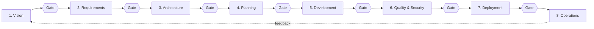
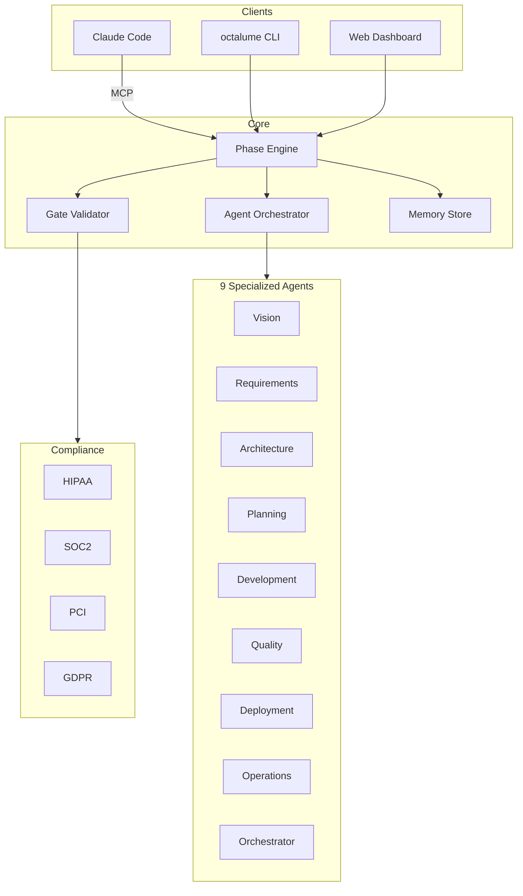

<div align="center">

# OCTALUME

### The AI-Native SDLC Framework for Regulated Enterprises

**Ship compliant software faster.** 8 phases. Quality gates. Multi-agent orchestration. Built on Claude Code + MCP.

[](https://github.com/Harery/OCTALUME/actions/workflows/ci.yml)
[](LICENSE)
[](https://www.python.org/downloads/)
[](https://pypi.org/project/octalume/)
[](https://modelcontextprotocol.io)
[](https://claude.com/claude-code)
[](docs/compliance.md)
[](docs/compliance.md)
[](docs/compliance.md)
[](https://github.com/Harery/OCTALUME/stargazers)

[**Quickstart**](#-quickstart-5-minutes) ·
[**Why OCTALUME**](#-why-octalume) ·
[**Architecture**](#-architecture) ·
[**Use Cases**](#-use-cases) ·
[**Compare**](#-compare) ·
[**Docs**](docs/index.md) ·
[**Roadmap**](#-roadmap)

</div>

---

> **Octa** = 8 phases · **Lume** = light, guidance.
> OCTALUME walks your AI agents and your team from vision to production with auditable, gated, compliance-aware steps — so "vibe coding" finally becomes shippable in healthcare, finance, defense, and gov.

<!-- DEMO PLACEHOLDER: replace this comment with an animated GIF (1280x720) at docs/assets/demo.gif
     once recorded. Suggested flow: `octalume init demo --compliance hipaa soc2` →
     `octalume start 1` → `octalume gate 1` → `octalume dashboard`. -->

## TL;DR

```bash
pip install octalume
octalume init my-app --compliance hipaa soc2
octalume start 1
```

That's it. You now have an 8-phase, gate-driven, audit-logged SDLC running locally — with 30+ MCP tools available to Claude Code so the model can drive each phase, request reviews, and stop at quality gates instead of hallucinating its way to "done".

---

## Why OCTALUME

Most AI coding tools optimize for **lines of code per minute**. That metric kills you the moment a regulator, an auditor, or a CTO asks: *"Show me the decision trail."*

OCTALUME treats AI-assisted development as a **regulated industrial process**, not a chat:

| Pain | Typical AI coding | OCTALUME |
|---|---|---|
| No audit trail for AI decisions | Chat history, manual screenshots | Every artifact + gate decision is signed and queryable |
| Agents drift off scope | "Forgot" the requirement | Phase 2 requirements pinned; gates block phase 5 advance |
| Compliance is bolted on at the end | Pen test the week before launch | HIPAA / SOC 2 / GDPR / PCI scanners run continuously |
| Multi-agent chaos | One mega-prompt, no roles | 9 typed agents with phase-bounded responsibilities |
| Can't onboard the next dev | "Ask the senior" | Memory store + traceable artifacts per phase |

If you've ever had to answer **"how did this code end up in production?"** for an auditor — OCTALUME is for you.

---

## Quickstart (5 minutes)

### 1. Install

```bash
pip install octalume          # latest from PyPI
# or, from source:
git clone https://github.com/Harery/OCTALUME && cd OCTALUME && pip install -e ".[dev]"
```

### 2. Initialize a project

```bash
octalume init my-saas \
  --description "Telehealth booking platform" \
  --compliance hipaa soc2
```

### 3. Walk the 8 phases

```bash
octalume start 1            # Vision & Strategy
octalume status             # See current phase, gates, agents
octalume gate 1             # Run quality gate check
octalume complete 1         # Advance to phase 2 (only if gate passes)
```

### 4. Plug into Claude Code (MCP)

Add to your Claude Code MCP config:

```json
{
  "mcpServers": {
    "octalume": {
      "command": "python",
      "args": ["-m", "octalume.mcp.server"]
    }
  }
}
```

Claude Code now has 30+ tools (`lifecycle_phase_*`, `lifecycle_gate_*`, `lifecycle_compliance_*`, ...) to drive your SDLC instead of just writing code.

### 5. Watch it in the dashboard

```bash
octalume dashboard           # http://localhost:8000
```

---

## The 8 Phases



| # | Phase | Owner | Typical Duration | Exit Gate |
|:-:|---|---|:-:|---|
| 1 | Vision & Strategy | Product Owner | 1 week | Stakeholder signoff, success metrics defined |
| 2 | Requirements & Scope | Product Owner | 2 weeks | Acceptance criteria, compliance mapping |
| 3 | Architecture & Design | CTA | 1 week | ADRs, threat model, data classification |
| 4 | Development Planning | Project Manager | 1 week | Backlog, capacity, risk register |
| 5 | Development Execution | Tech Lead | Variable | Code review, unit + integration tests green |
| 6 | Quality & Security | QA Lead | 2 weeks | Compliance scan, pen test, SBOM |
| 7 | Deployment & Release | DevOps | 1 week | Change record, rollback plan, runbook |
| 8 | Operations & Maintenance | SRE | Ongoing | SLOs, incident response, periodic review |

Each gate is a *machine-checkable* set of conditions — not a slack message.

---

## Architecture



```text
octalume/
├── core/         Phase engine, gates, orchestrator, state, memory, tenancy
├── mcp/          MCP server exposing 30+ lifecycle_* tools
├── agents/       9 phase-specialized agents (+ orchestrator)
├── compliance/   HIPAA, SOC 2, PCI DSS, GDPR scanners
├── a2a/          Agent-to-Agent protocol
├── worker/       Async task workers (Celery-compatible)
└── utils/        Logging, configuration, observability
```

---

## Use Cases

<table>
<tr>
<td width="33%" valign="top">

### Healthcare / HealthTech
Telehealth, EHR, claims, AI diagnostics.
- HIPAA controls auto-mapped to phases
- PHI handling baked into gates
- Audit log for OCR / 21 CFR Part 11

</td>
<td width="33%" valign="top">

### FinTech / Banking
Payments, lending, trading.
- PCI DSS scope tracking
- SOX evidence collection in phase 6
- SoD enforced via agent roles

</td>
<td width="33%" valign="top">

### Government / Defense
Fed, state, ITAR/DoD contractors.
- FedRAMP / NIST 800-53 mappable
- Air-gapped install supported
- Traceability matrices on demand

</td>
</tr>
<tr>
<td valign="top">

### SaaS at Scale
Multi-tenant B2B platforms.
- SOC 2 Type II evidence pipeline
- GDPR data-subject workflows
- Multi-tenant aware state

</td>
<td valign="top">

### AI Product Teams
Anyone shipping LLM features.
- Agent governance + guardrails
- Prompt + tool versioning
- "Show your work" for AI decisions

</td>
<td valign="top">

### Regulated Startups
Pre-Series-B teams who can't afford a CISO yet.
- Compliance-by-default
- Replaces 5+ spreadsheets
- Diligence-ready in week one

</td>
</tr>
</table>

---

## Compare

| | **OCTALUME** | LangGraph / AutoGen | Cursor / Copilot | Traditional SDLC tools (Jira + ALM) |
|---|:---:|:---:|:---:|:---:|
| AI-native | ✅ | ✅ | ✅ | ❌ |
| Phase-gated workflow | ✅ | ❌ | ❌ | ⚠️ Manual |
| Built-in compliance scanners | ✅ | ❌ | ❌ | ❌ |
| Agent role separation | ✅ 9 typed agents | ⚠️ DIY | ❌ | ❌ |
| MCP / Claude Code native | ✅ | ❌ | ⚠️ | ❌ |
| Audit trail per AI decision | ✅ | ❌ | ❌ | ⚠️ |
| Self-hostable, open source | ✅ MIT | ✅ | ❌ | ❌ |
| Time to first value | **5 min** | hours | 5 min | weeks |

---

## Compliance Standards

| Standard | Status | Coverage |
|---|:-:|---|
| HIPAA | ✅ Built-in scanner | Administrative, physical, technical safeguards |
| SOC 2 | ✅ Built-in scanner | Security, availability, confidentiality |
| PCI DSS | ✅ Built-in scanner | v4.0 control mapping |
| GDPR | ✅ Built-in scanner | Articles 5, 25, 30, 32, 33 |
| SOX | ⚠️ Evidence pipeline | ITGC mapping |
| ISO 27001 | 🛣️ Roadmap | Annex A controls |
| NIST 800-53 / FedRAMP | 🛣️ Roadmap | Moderate baseline |
| DoD / ITAR | 🛣️ Roadmap | CMMC L2 |

See [docs/compliance.md](docs/compliance.md) for the full mapping.

---

## Python API

```python
from octalume import PhaseEngine, ProjectStateManager

async def main():
    manager = ProjectStateManager()
    state = await manager.create(
        name="my-project",
        compliance_standards=["hipaa", "soc2"],
    )

    engine = PhaseEngine(manager)
    await engine.start_phase(state, 1)
    state, gate = await engine.complete_phase(state, 1)
    assert gate.passed, gate.failures
```

Full API: [docs/python-api.md](docs/python-api.md).

---

## MCP Tools (30+)

| Category | Tools |
|---|---|
| **Phase** | `lifecycle_phase_start`, `_status`, `_validate`, `_transition`, `_rollback` |
| **Agent** | `lifecycle_agent_spawn`, `_delegate`, `_status`, `_list`, `_terminate` |
| **Artifact** | `lifecycle_artifact_create`, `_get`, `_search`, `_link` |
| **Gate** | `lifecycle_gate_check`, `_bypass`, `_list`, `lifecycle_go_no_go` |
| **Compliance** | `lifecycle_compliance_scan`, `_report`, `_configure` |
| **Memory** | `lifecycle_memory_save`, `_load`, `_query` |
| **Observability** | `lifecycle_trace_add`, `_get`, `lifecycle_health_check` |

Full reference: [docs/mcp-tools.md](docs/mcp-tools.md).

---

## Roadmap

- [x] 8-phase engine + quality gates
- [x] HIPAA / SOC 2 / PCI / GDPR scanners
- [x] MCP server with 30+ tools
- [x] React dashboard
- [ ] ISO 27001 + NIST 800-53 scanners
- [ ] OPA / Rego policy plug-in
- [ ] SBOM (CycloneDX) auto-generation per release
- [ ] Slack / Teams gate-approval bots
- [ ] OCTALUME Cloud (managed control plane)
- [ ] VS Code extension

Vote / suggest on [GitHub Discussions](https://github.com/Harery/OCTALUME/discussions).

---

## Star History

[](https://star-history.com/#Harery/OCTALUME&Date)

If OCTALUME saves you a week of compliance pain, **please star the repo** — it's the single biggest thing you can do to help.

---

## Contributing

We love contributors. Start here:

1. Read [CONTRIBUTING.md](CONTRIBUTING.md) and [CODE_OF_CONDUCT.md](CODE_OF_CONDUCT.md).
2. Pick a [good first issue](https://github.com/Harery/OCTALUME/labels/good%20first%20issue).
3. Fork, branch, PR. CI runs Ruff, Black, MyPy, Bandit, Trivy, pytest.

Security issues: see [SECURITY.md](SECURITY.md) — please do not open public issues.

To cite OCTALUME in academic work, see [CITATION.cff](CITATION.cff).

---

## License

[MIT](LICENSE). Use it, fork it, ship it. Attribution appreciated, not required. "OCTALUME" is a trademark of Mohamed ElHarery — see [NOTICE](NOTICE).

---

## Author

**Mohamed Harery** — Digital Solutions Architect, 15+ years across cybersecurity, cloud, and enterprise infrastructure.
[harery.com](https://harery.com) · [LinkedIn](https://www.linkedin.com/in/harery) · [GitHub](https://github.com/Harery)

<div align="center">

**Built with OCTALUME.** Ship compliant software, one phase at a time.

</div>
