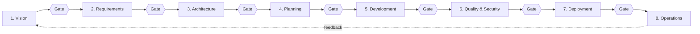

<!-- KEYWORDS: octalume, claude code framework, enterprise sdlc, 8-phase sdlc, multi-agent orchestration, ai governance, model context protocol, mcp server, hipaa compliance, soc 2 compliance, pci dss, gdpr, sox, regulated industries, audit trail, quality gates, agentic development, python framework, ai-assisted development, software architecture, structured prompting, claude code skill, mcp tools, compliance scanner, regulated ai -->

<div align="center">

# OCTALUME

**An 8-phase enterprise SDLC framework with multi-agent orchestration for Claude Code.**

[](https://github.com/Harery/OCTALUME/actions/workflows/ci.yml)
[](LICENSE)
[](https://www.python.org/downloads/)
[](https://github.com/Harery/OCTALUME/releases/tag/v2.0.0)
[](https://github.com/Harery/OCTALUME/releases)
[](https://github.com/Harery/OCTALUME/stargazers)

</div>

> OCTALUME treats a software project the way an architect treats a building — every system has structural intent, every connection is deliberate, every decision must serve the people who depend on it.

<p align="right"><sub><code>DRAWING NO. 01.00  ·  REV. 2026.05  ·  SHEET 01 OF 05</code></sub></p>

[Problem](#the-problem) · [Install](#install) · [Quickstart](#quickstart) · [What you get](#what-you-get) · [How it works](#how-it-works) · [Compare](#compare) · [FAQ](#faq) · [Documentation](#documentation) · [Roadmap](#roadmap)

## The problem

AI coding tools generate code quickly. They do not generate the decision trail an auditor needs. When a regulator asks how a line of code reached production in a HIPAA, SOC 2, PCI DSS, or SOX environment, chat logs and commit messages are not an answer. Most teams bolt governance on at the end. By then the evidence is gone.

## Install

```bash
git clone https://github.com/Harery/OCTALUME && cd OCTALUME && pip install -e ".[dev]"
```

## Quickstart

```bash
octalume init my-app --compliance hipaa soc2   # scaffold a project with controls mapped
octalume start 1                                # enter Phase 1 (Vision & Strategy)
octalume gate 1 && octalume complete 1          # run the gate; advance only if it passes
```

## What you get

```text
octalume/
├── core/         Phase engine, gates, orchestrator, state, memory, tenancy
├── mcp/          MCP server exposing 30+ lifecycle_* tools to Claude Code
├── agents/       9 phase-specialized agents (+ orchestrator)
├── compliance/   HIPAA, SOC 2, PCI DSS, GDPR scanners
├── a2a/          Agent-to-Agent protocol
├── worker/       Async task workers (Celery-compatible)
└── utils/        Logging, configuration, observability
web/
├── frontend/     Vite + React dashboard (phase view, gate status, audit log)
└── backend/      FastAPI service backing the dashboard
mcp-server/       Standalone MCP entry point (python -m octalume.mcp.server)
```

Each phase produces typed artifacts. Each gate is a machine-checkable set of conditions. Each compliance scan is signed and queryable.

## How it works

OCTALUME drives a project through eight sequential phases. Each phase has an owning agent, required artifacts, and a quality gate. The gate is a function, not a meeting — it either passes or it blocks the transition.

A central Phase Engine coordinates nine agents (one per phase plus an orchestrator). The MCP server surfaces 30+ `lifecycle_*` tools so Claude Code can start phases, request reviews, run compliance scans, and stop when a gate fails. State and decisions persist in a memory store the next contributor can read.



Plug it into Claude Code with a one-line MCP config:

```json
{
  "mcpServers": {
    "octalume": { "command": "python", "args": ["-m", "octalume.mcp.server"] }
  }
}
```

## Compare

| Capability                       | OCTALUME      | LangGraph | AutoGen | semantic-kernel | Cursor | Jira |
|:---------------------------------|:-------------:|:---------:|:-------:|:---------------:|:------:|:----:|
| Multi-agent orchestration        | 9 typed roles | DIY graph | DIY     | Plugins         | No     | No   |
| Full-SDLC scope (8 phases)       | Yes           | No        | No      | No              | No     | Partial |
| Built-in compliance scanners     | HIPAA / SOC 2 / PCI / GDPR | No | No | No        | No     | No   |
| Machine-checkable quality gates  | Yes           | No        | No      | No              | No     | Manual |
| Claude Code / MCP native         | Yes           | No        | No      | No              | Partial| No   |
| Audit trail per AI decision      | Signed, queryable | No    | No      | No              | No     | Partial |
| Self-hostable, MIT-licensed      | Yes           | Yes       | Yes     | Yes             | No     | No   |

## FAQ

### What is OCTALUME?
An 8-phase, gate-driven SDLC framework with nine phase-specialized agents, a Model Context Protocol server, four compliance scanners, and a web dashboard. It runs locally and integrates natively with Claude Code.

### Is this production-ready?
v2.0.0 is the first stable release. The phase engine, gates, MCP server, and HIPAA / SOC 2 / PCI / GDPR scanners are covered by CI. Treat it as 1.x-grade for the dashboard and a2a protocol — those are still iterating.

### Does it work without Claude Code?
Yes. The CLI, phase engine, and compliance scanners run standalone. The MCP server works with any MCP-compatible client. Claude Code is the deepest integration today; Cursor and Windsurf adapters are on the roadmap.

### How do I customize for HIPAA or SOC 2?
Pass `--compliance hipaa soc2` to `octalume init`. The relevant control catalogs map to phase gates automatically. Override individual controls in `octalume.yaml`; see [docs/compliance.md](docs/compliance.md) for the full mapping.

### What is the difference between OCTALUME and the OCTALUM family?
OCTALUME is the flagship — the framework that drives a regulated SDLC. The OCTALUM family also includes PYLAB (Python practice), PULSE (Linux maintenance), and octalum-bdtb (brain-dump-to-build skill). See the footer for the full set.

### Can I cite it in a paper?
Yes. See [CITATION.cff](CITATION.cff) for the canonical reference, including DOI-ready metadata.

## Documentation

- [docs/index.md](docs/index.md) — entry point
- [docs/getting-started.md](docs/getting-started.md) — first project, end to end
- [docs/phases.md](docs/phases.md) — the 8 phases and their gates
- [docs/agents.md](docs/agents.md) — the 9 agents and their boundaries
- [docs/mcp-tools.md](docs/mcp-tools.md) — 30+ `lifecycle_*` MCP tools
- [docs/python-api.md](docs/python-api.md) — `PhaseEngine`, `ProjectStateManager`
- [docs/compliance.md](docs/compliance.md) — HIPAA / SOC 2 / PCI / GDPR mappings
- [docs/architecture.md](docs/architecture.md) — internals and extension points

## Roadmap

- 2026-Q3 — Publish `octalume` to PyPI (`pip install octalume`)
- 2026-Q3 — ISO 27001 and NIST 800-53 scanners
- 2026-Q4 — `docs.octalume.dev` (GitHub Pages) goes live
- 2026-Q4 — v2.1 multi-tenant control plane
- 2027-Q1 — OPA / Rego policy plug-in, CycloneDX SBOM auto-generation
- 2027-Q2 — Cursor and Windsurf MCP adapters

## Contributing, License, Security

- Contributing: see [CONTRIBUTING.md](CONTRIBUTING.md) and [CODE_OF_CONDUCT.md](CODE_OF_CONDUCT.md).
- License: [MIT](LICENSE). "OCTALUME" is a trademark of Mohamed ElHarery — see [NOTICE](NOTICE).
- Security: report privately via [SECURITY.md](SECURITY.md). 22 of 22 Dependabot alerts resolved in this release.
<!-- ============================================================== -->
<!-- UNIFIED OCTALUM FAMILY FOOTER — keep verbatim across every repo -->
<!-- ============================================================== -->

---

<div align="center">

### Drawn by the same hand

A working portfolio of digital infrastructure, designed and maintained by [**Mohamed Harery**](https://harery.com) — Architect of Digital Systems.

| Sheet | Repo | What it is |
|:--:|:--|:--|
| 00 | [**harery.com**](https://github.com/Harery/Mo) | The studio — portfolio, ledger, contact |
| 01 | [**OCTALUME**](https://github.com/Harery/OCTALUME) | 8-phase enterprise SDLC framework |
| 02 | [**OCTALUM-PYLAB**](https://github.com/Harery/OCTALUM-PYLAB) | Python DSA & coding-interview prep |
| 03 | [**OCTALUM-PULSE**](https://github.com/Harery/OCTALUM-PULSE) | Cross-distro Linux maintenance CLI |
| 04 | [**octalum-bdtb**](https://github.com/Harery/octalum-bdtb) | 12-stage Claude Code Skill — brain-dump → product |

<sub>
  <a href="https://harery.com">harery.com</a> ·
  <a href="https://github.com/Harery">github.com/Harery</a> ·
  <a href="https://www.linkedin.com/in/harery/">LinkedIn</a>
</sub>

<sub>BLUEPRINT · drawn 2026 · MIT-licensed code · all drawings reserved</sub>

</div>
